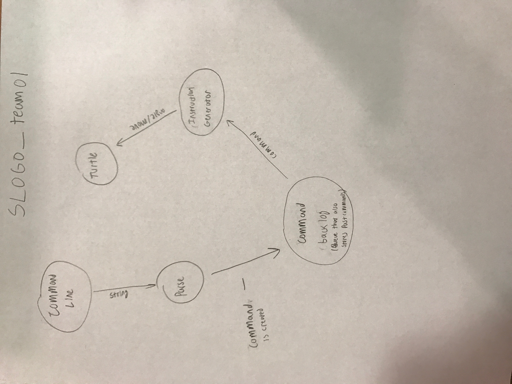

# Slogo API
### When does parsing need to take place and what does it need to start properly?
Parsing needs to take place after the user enters a command and presses enter. To start properly, the parser requires a string representing a command.
	
### What is the result of parsing and who receives it?
After parsing, there will be a class that receives the result and based on the entry and the language file, will generate a set of instructions for the turtle to complete. 

### When are errors detected and how are they reported?
Errors from the user will be detected and classified on the command line during the parsing stage of the input data. These will relate to the corresponding error message to inform the user what error they have made, or an unknown error otherwise. The error handling within the code will be extensive, for any possible situation that may result in a program error or failure. This will include many try/catch implementations. 

### What do commands know, when do they know it, and how do they get it?
After parsing, an object that inherits an instruction interface is created. At this point in time, the command only knows its type and the parameters that the user gave within the command line. Commands are stored within the command backlog, a queue-like structure that records all commands used. Commands are then pushed to the instruction generator, where they are filled with specific movements based on the command.

### How is the GUI updated after a command has completed execution?
After a command has completed execution, the turtle object updates by changing its X, Y coordinates, and drawing a line between its new x,y coordinates and previous x,y coordinates. To convey where a turtle should move, we plan to have an instruction interface that takes the parsed command and translates it into a set of instructions that can be interpreted by the turtle object, which implements the moveable interface. The turtle accesses the current instruction from a backlog of instructions, and iterates through this log to move as long as it doesn’t hit the end of the list.

